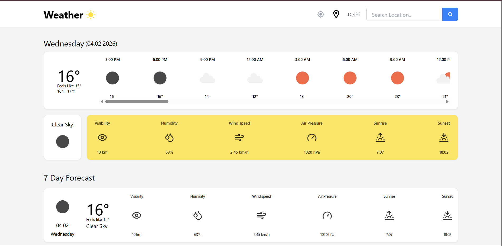
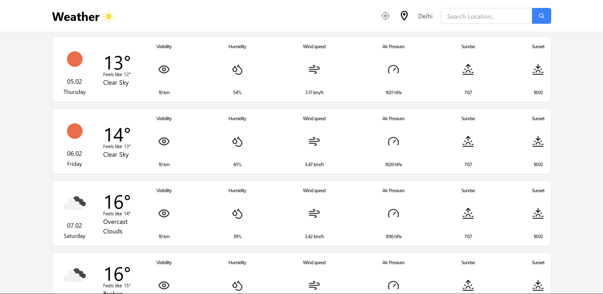

# 🌤️ Weather Forecast Web App

A modern and responsive **Weather Forecast Web Application** built using **Next.js** and **TypeScript**.  
This application provides **real-time weather data**, **hourly updates**, and a **7-day forecast** using the **OpenWeatherMap API**.

## 🚀 Live Demo

https://weatherapp-5pr3.onrender.com

## 📸 Preview

## 🛠️ Tech Stack

- **Framework:** Next.js  
- **Language:** TypeScript  
- **Styling:** Tailwind CSS  
- **API:** OpenWeatherMap  
- **Deployment:** Render  

## 🌐 API Used

### OpenWeatherMap API

- Current Weather Data API  
- 5 Day / 3 Hour Forecast API  
- 7 Day Forecast API  

API Documentation:  
https://openweathermap.org/api

## ✨ Features

- City-based weather search  
- Real-time current weather data  
- Hourly weather forecast  
- 7-day weather forecast  
- Temperature and feels-like temperature  
- Wind speed, humidity, visibility, and air pressure  
- Sunrise and sunset timings  
- Fully responsive UI for mobile and desktop  

## 📂 Project Structure
    WEATHERAPP/
    ├── public/
    ├── src/
    │   ├── app/
    │   │   ├── atoms.ts
    │   │   ├── favicon.ico
    │   │   ├── globals.css
    │   │   ├── layout.tsx
    │   │   ├── page.tsx
    │   │   └── Providers.tsx
    │   ├── components/
    │   │   ├── Container.tsx
    │   │   ├── ForecastWeatherDetail.tsx
    │   │   ├── Navbar.tsx
    │   │   ├── Searchbox.tsx
    │   │   ├── WeatherDetails.tsx
    │   │   └── WeatherIcon.tsx
    │   └── utils/
    ├── .env.example
    ├── .gitignore
    ├── eslint.config.mjs
    ├── next-env.d.ts
    ├── next.config.ts
    ├── package-lock.json
    ├── package.json
    ├── postcss.config.js
    ├── README.md
    ├── tailwind.config.js
    └── tsconfig.json

## 🔑 Environment Variables

Create a `.env.local` file in the root directory and add your OpenWeatherMap API key.

    NEXT_PUBLIC_OPENWEATHER_API_KEY=your_api_key_here

Get your API key from:  
https://openweathermap.org/api

## ▶️ Getting Started

### Clone the Repository

    git clone https://github.com/your-username/weather-app.git

### Navigate to the Project Directory

    cd WeatherApp

### Install Dependencies

    npm install

### Run the Development Server

    npm run dev

The application will run at:

    http://localhost:3000

## 🚀 Deployment

This project is deployed using **Render**.

### Build Command

    npm run build

### Start Command

    npm start

## 🤝 Contributing

Contributions are welcome.  
Fork the repository and submit a pull request for improvements or bug fixes.

## 📄 License

This project is licensed under the **MIT License**.

## 👨‍💻 Author

Ayush Thomas  
2nd Year BTech Student
Kerala, India  
